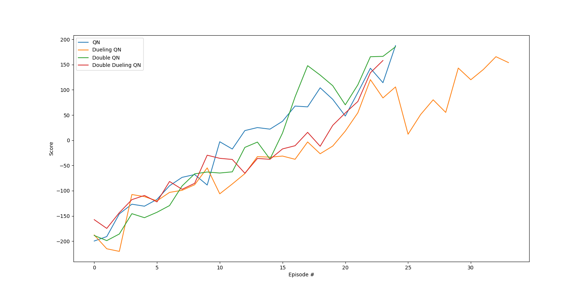

# [Project] Pytorch Implementation of OpenAI gym lunarlander-v2


## Introduction
The repository is my toy-project result of the class, "Introduction to Reinforcement Learning (CSE6516-01)" @ 2022-2 semester in Sogang University.
Project topic is a comparison of different DQN algorithms in the 'LunarLander-v2'
The works based on the Deep Q Network(DQN), and I used two algorithms, Dueling and Double.
In my experiments, 4 kinds of networks shows scores around 100 points in 10000 testings, especially, Double-Q-Network shows lowest average score 99.2.
As other networks' score are slightly different, The highest score is for DQN.

## Installation

Clone this repository:

```bash
https://github.com/nicesonnday/lunarlander-v2.git
cd lunarlander-v2/
```

The code is tested with python 3.8, cuda == 11.1, pytorch == 1.10.1. Additionally dependencies include: 

```bash
torch==1.10.1
torchaudio==0.10.1
torchvision==0.11.2
torchsummary==1.5.1
numpy==1.23.4
python==3.8.0
gym==0.26.2
pygame=2.1.0
box2d-py==2.3.5
swig==4.1.0
tqdm=4.61.1
moviepy
IPython
matplotlib
imageio
Pillow
```
## Results


## Usage

### Training
python main.py --mode='train' --save_video False --save_plot=True --num_test=1000

### Testing
python main.py --mode='test' --save_video=True --save_plot=True --num_test=1000
